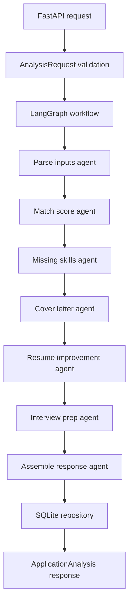

# Architecture

AI Job Application Copilot is a FastAPI backend with a deterministic multi-agent workflow.
The app keeps the first release simple, auditable, and testable while leaving provider seams for
future LLM-backed generation.

## Key Modules

- `api/routes.py`: HTTP endpoints for health, JSON analysis, file analysis, list, and get.
- `agents/graph.py`: LangGraph workflow definition.
- `agents/steps.py`: Agent node implementations.
- `services/analyzer.py`: Deterministic parsing, skill extraction, scoring, and gap detection.
- `services/providers.py`: Deterministic generation plus LLM provider extension protocol.
- `db/repository.py`: SQLite persistence.
- `models/schemas.py`: Pydantic request and response contracts.

## Deterministic First Version

The current release intentionally avoids paid LLM calls. Skill extraction uses a curated alias map,
keyword overlap uses deterministic token counts, and generated assets use templates. This makes the
project suitable for CI, demos, and local development without secrets.

## Persistence

Analyses are stored in SQLite as JSON snapshots plus summary fields for listing. The default local
database is `./data/copilot.db`, configured by `AI_COPILOT_DATABASE_URL`.

